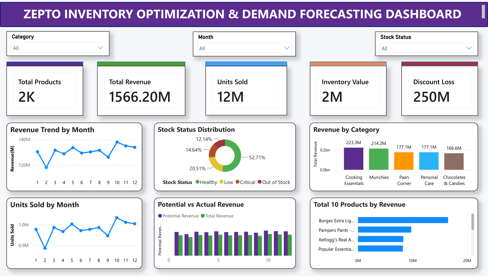

# 📊 Zepto Inventory Optimization & Demand Forecasting Dashboard



## 📌 Project Overview

This project presents an end-to-end business analytics solution for analysing Zepto's inventory, pricing strategy, product performance, demand trends, and discount impact. The solution combines Python, SQL, PostgreSQL, and Power BI to transform raw retail data into actionable business insights through an interactive dashboard.

The dashboard enables decision-makers to monitor inventory health, identify high-performing products, evaluate discount effectiveness, and analyse monthly sales and revenue trends.

---

## 🎯 Objectives

- Analyse product-wise and category-wise revenue.
- Monitor inventory availability and stock status.
- Evaluate the impact of discounts on revenue.
- Track monthly revenue and units sold.
- Identify top-performing products.
- Build an interactive dashboard for business decision-making.

---

## 🛠️ Tech Stack

- **Python** (Pandas, NumPy)
- **SQL**
- **PostgreSQL**
- **Power BI**
- **DAX**
- **Power Query**

---

## 📂 Project Workflow

```text
Raw Dataset
      │
      ▼
Python Data Cleaning & Preprocessing
      │
      ▼
SQL Data Analysis
      │
      ▼
PostgreSQL Database
      │
      ▼
Power BI Dashboard
      │
      ▼
Business Insights & Decision Making
```

---

## 📈 Dashboard Features

### 📌 KPI Cards

- Total Products
- Total Revenue
- Units Sold
- Inventory Value
- Discount Loss

### 📊 Visualisations

- Revenue Trend by Month
- Top 10 Products by Revenue
- Revenue by Category
- Stock Status Distribution
- Units Sold by Month
- Potential vs Actual Revenue Comparison

### 🎛️ Interactive Filters

- Category
- Month
- Stock Status

---

## 📊 Key Business Insights

- Identifies the highest revenue-generating product categories.
- Tracks monthly revenue and sales trends.
- Highlights the impact of discounts on actual revenue.
- Monitors inventory availability using stock status distribution.
- Identifies top-performing products based on revenue.
- Supports inventory optimisation and pricing decisions.

---

## 📁 Repository Structure

```
📦 Zepto-Inventory-Pricing-Analytics
│
├──  README.md
├──  Zepto_Dashboard.pbix
├──  Zepto_Dashboard.pdf
├──  Zepto_Dashboard.png
├──  final_zepto_cleaned.csv
├──  zepto_analysis.sql
```

---

## 📷 Dashboard Preview

The dashboard provides a comprehensive overview of inventory performance, revenue trends, product analysis, and stock distribution through interactive Power BI visualisations.

> Dashboard Preview


---

## 🚀 Future Enhancements

- AI-based demand forecasting
- Inventory replenishment recommendations
- Supplier performance analytics
- Customer purchasing behaviour analysis
- Predictive inventory optimisation using Machine Learning

---

## 💼 Skills Demonstrated

- Data Cleaning
- Exploratory Data Analysis (EDA)
- SQL Querying
- Database Management
- Data Visualisation
- Dashboard Design
- Power BI
- DAX
- Business Intelligence
- Inventory Analytics
- Demand Forecasting

---

## ⭐ Project Highlights

✔ End-to-end Business Intelligence Project

✔ Interactive Power BI Dashboard

✔ SQL-Based Business Analysis

✔ Python Data Cleaning & Preprocessing

✔ Inventory Optimisation Analytics

✔ Demand Forecasting Dashboard

✔ Revenue & Pricing Analysis

---

